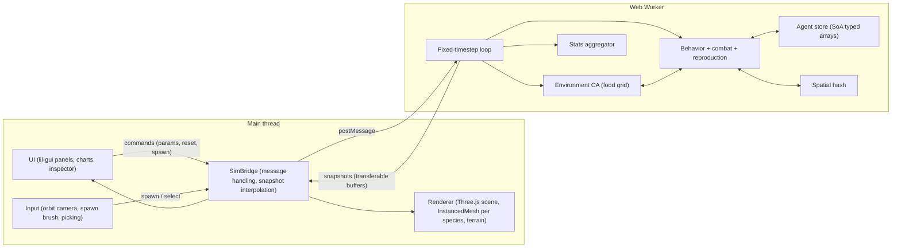
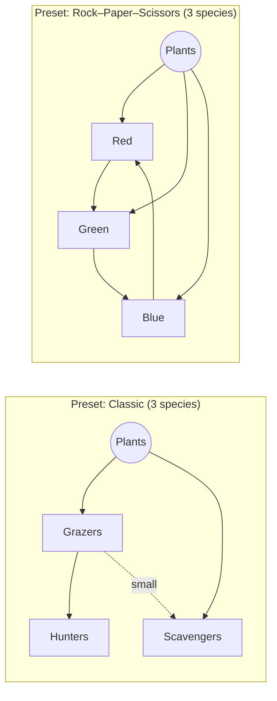
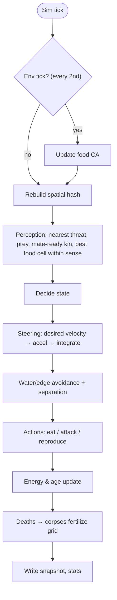
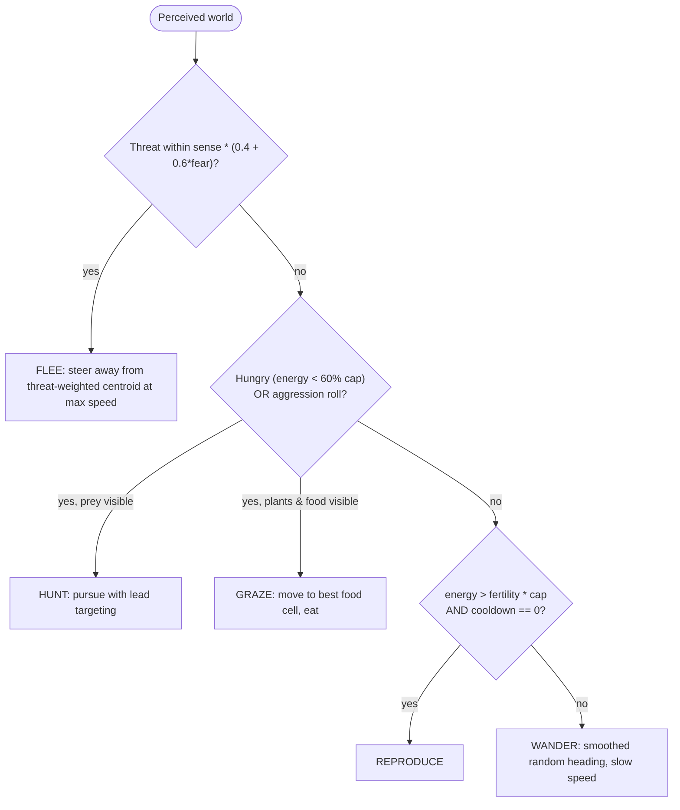

# Primordia — 3D Evolving Ecosystem Simulation

> Working title. An implementation spec intended to be handed directly to Claude Code.

## 0. Instructions for the implementer (Claude Code)

- Build the **entire app** described here in one pass. This is a fun project: **no unit tests, no test framework, no phased rollout.** Verify by running `npm run build` (must compile with zero TypeScript errors) and `npm run dev` (must run).
- Static single-page app. **No backend.** Must deploy to GitHub Pages via the included workflow.
- TypeScript `strict: true`. Keep all tunable numbers in `src/config.ts` — never hard-code balancing constants elsewhere.
- Prefer simple, readable code over abstractions. No UI framework (no React); plain DOM + `lil-gui`.
- Where this spec gives a formula with constants, treat constants as **starting values** to be tuned. After the app runs, do a short tuning pass so the default preset reaches a stable coexistence (see §11).

---

## 1. Concept

A Game-of-Life-inspired world rendered in 3D with Three.js. The world is a 2D simulation grid displayed as 3D terrain.

- **Environment layer** — a cellular automaton: plant food grows, spreads (GoL-style birth rule), gets eaten, and regrows.
- **Agent layer** — 2 to 4 species of creatures that move continuously over the grid. They graze, hunt, flee, fight, reproduce, and die.
- **Evolution** — each creature has a genome of traits. Offspring inherit with mutation. Traits have energy costs, so trade-offs produce emergent niches.

The user watches, tweaks parameters live, spawns creatures with a brush, and inspects individuals.

---

## 2. Tech stack

| Concern | Choice |
|---|---|
| Build | Vite + TypeScript |
| Rendering | `three` (latest), `OrbitControls` from `three/examples/jsm/controls/OrbitControls.js` |
| Noise | `simplex-noise` |
| UI controls | `lil-gui` |
| Charts | Custom lightweight canvas line chart (no chart lib) |
| Simulation thread | Web Worker (Vite `new Worker(new URL(...), { type: 'module' })`) |
| Deploy | GitHub Pages via GitHub Actions |

---

## 3. Architecture



### Main ↔ Worker message protocol

All messages are typed in `src/shared/messages.ts`.

**Main → Worker**

| type | payload |
|---|---|
| `init` | `{ seed, preset, worldSize }` |
| `reset` | `{ seed, preset }` |
| `setPaused` | `{ paused }` |
| `setSpeed` | `{ multiplier }` (0.25×–16×) |
| `setParams` | partial config object (live-tunable params) |
| `setSpecies` | full species table (diet matrix, base genomes) |
| `spawn` | `{ speciesId, x, z, count, radius }` |
| `select` | `{ agentId \| null }` |
| `returnBuffer` | buffer handed back for reuse (ping-pong) |

**Worker → Main**

| type | payload | frequency |
|---|---|---|
| `agents` | `{ tick, count, buffer: Float32Array }` | every sim tick (capped to ~30/s) |
| `food` | `{ buffer: Uint8Array }` (food 0–255 per cell) | every 5 ticks |
| `stats` | populations per species, avg traits per species, births/deaths | every 10 ticks |
| `selected` | full detail of selected agent (or `null` if it died) | every tick while selected |

**Agent snapshot layout** — 8 floats per agent: `[id, speciesId, x, z, heading, size, state, energyRatio]`. Use transferable `ArrayBuffer`s with a ping-pong pool (main returns buffers via `returnBuffer`) to avoid GC churn.

---

## 4. Project structure

```
primordia/
├─ index.html
├─ vite.config.ts            # base: './' so it works on GitHub Pages subpaths
├─ tsconfig.json
├─ package.json
├─ .github/workflows/deploy.yml
└─ src/
   ├─ main.ts                # bootstraps renderer, UI, bridge
   ├─ config.ts              # ALL tunables + species presets
   ├─ shared/
   │  ├─ messages.ts         # message types
   │  ├─ types.ts            # Genome, SpeciesDef, Preset, etc.
   │  └─ rng.ts              # seeded PRNG (mulberry32) + helpers (gaussian)
   ├─ sim/
   │  ├─ worker.ts           # worker entry, message router, fixed-step loop
   │  ├─ world.ts            # terrain generation (height, water, fertility)
   │  ├─ environment.ts      # food CA
   │  ├─ agents.ts           # SoA store, alloc/free, snapshot writer
   │  ├─ genome.ts           # traits, mutation, cost functions
   │  ├─ spatialHash.ts
   │  ├─ behavior.ts         # perception + decision + steering
   │  ├─ interactions.ts     # eating, combat, reproduction, death
   │  └─ stats.ts
   ├─ render/
   │  ├─ scene.ts            # renderer, camera, lights, fog, sky color
   │  ├─ terrain.ts          # heightmap mesh + food DataTexture overlay
   │  ├─ creatures.ts        # InstancedMesh per species, interpolation
   │  ├─ geometries.ts       # low-poly body per species archetype
   │  └─ picking.ts          # raycast terrain + instances
   └─ ui/
      ├─ panel.ts            # lil-gui controls
      ├─ chart.ts            # canvas line chart
      ├─ inspector.ts        # selected creature card
      └─ hud.ts              # tick counter, FPS, populations
```

---

## 5. World & environment (the Game-of-Life layer)

### 5.1 Terrain (generated once per seed)

- Grid `W × H` (default **192 × 192**), 1 world unit per cell, bounded (no wraparound — edges are walls).
- `height[cell]` from 2 octaves of simplex noise. Cells below `waterLevel` are **water**: impassable, no food. Keep water ≈ 10–15% of the map so it forms lakes/obstacles, not a sea.
- `fertility[cell]` 0.2–1.0 from a separate noise field. Scales growth rate → creates rich and poor regions.

### 5.2 Food cellular automaton

Each land cell holds `food ∈ [0, 1]` (stored as `Float32Array`, sent to main as `Uint8Array`). Update every **env tick** (every 2 sim ticks):

1. **Growth (logistic):** if `food > 0`: `food += growthRate * fertility * food * (1 - food) * dtEnv`.
2. **Birth (GoL homage):** if `food < 0.05` and the cell has **≥ 3 of 8 neighbors** with `food > 0.5`, it sprouts: `food = sproutAmount` with probability `sproutChance * fertility`.
3. **Spontaneous seeding:** tiny probability `seedChance` per bare cell per env tick so extinct regions can recover.
4. **Fertilization:** when a creature dies, add `corpseNutrient * size` to `fertility`-boosted food at its cell (clamped to 1).

Use a double buffer for steps 1–2 so updates read the previous state (classic CA rule).

**Starting values:** `growthRate 0.25/s`, `sproutAmount 0.15`, `sproutChance 0.3`, `seedChance 0.00002`, `initialFoodCoverage 0.4`.

---

## 6. Creatures

### 6.1 Storage

Structure-of-arrays in `agents.ts`, fixed capacity `MAX_AGENTS = 20000`, free-list allocation, monotonically increasing `id` for each new creature (ids are never reused — the renderer and inspector rely on this).

Per-agent fields: `id, species, x, z, vx, vz, heading, energy, age, state, targetId, cooldown, generation, parentId`, plus genome fields (below). `alive` flag or swap-remove — implementer's choice, but iteration must be dense and cheap.

### 6.2 Genome

| Trait | Range | Effect | Cost |
|---|---|---|---|
| `size` | 0.5 – 2.0 | combat power, energy capacity, bite size | metabolism ∝ size³ |
| `speed` | 1 – 10 cells/s | max movement speed | movement cost ∝ size³ · v² |
| `sense` | 2 – 16 cells | perception radius | ∝ sense |
| `aggression` | 0 – 1 | willingness to attack / hunt when not starving | indirect (fights hurt) |
| `fear` | 0 – 1 | how early it flees from threats | indirect (lost feeding time) |
| `fertility` | 0.3 – 0.9 | energy fraction at which it reproduces | lower = more, weaker kids |
| `lifespan` | 30 – 180 s | max age | none |
| `hue` | −0.1 – 0.1 | color offset within species palette (visual drift only) | none |

**Mutation:** each trait of an offspring = parent + gaussian(0, `mutationRate * traitRange`), clamped. Default `mutationRate 0.05`. With probability `bigMutationChance 0.01` use 4× sigma.

### 6.3 Energy model

```
capacity     = 100 * size²
basalCost/s  = kBasal * size³               (kBasal = 0.6)
moveCost/s   = kMove  * size³ * v²          (kMove  = 0.02, v = current speed)
senseCost/s  = kSense * sense               (kSense = 0.04)
```

Energy ≤ 0 → death (starvation). Age > lifespan → death (old age).

### 6.4 Species definitions

A species has: `name`, `color`, `archetype` (body geometry), `diet: { plants: boolean, eats: speciesId[] }`, `baseGenome`, `initialCount`. Up to **4 species**. The **diet matrix** is the core of the food web and must be editable in the UI.

**Presets** (in `config.ts`, selectable in UI):



- **Classic:** Grazers (plants), Hunters (eat Grazers), Omnivores (plants + small Grazers, i.e. only prey with smaller `size`).
- **Rock–Paper–Scissors:** 3 species, all eat plants, each hunts exactly one other. Cyclic dominance → spatial waves.
- **Four Kingdoms:** 2 herbivores (one fast/small, one big/slow), 1 hunter that eats both, 1 apex that eats the hunter.
- **Duel:** 2 herbivore species competing for the same plants only (pure resource competition).

Arrow `A → B` means "B eats A". Optional rule (toggle, default on): a predator can only kill prey whose `size ≤ predator.size * 1.5` — big prey can fight back (see §7.3).

---

## 7. Behavior

### 7.1 Per-tick pipeline



Fixed timestep `dt = 1/20 s`. Speed multiplier runs multiple steps per frame interval (cap steps per real frame to avoid spiral of death).

### 7.2 Decision (utility / priority based)



- A **threat** is any agent whose species can eat this one (per diet matrix) and passes the size rule.
- For omnivores, choose HUNT vs GRAZE by expected energy per distance.
- Re-evaluate the decision every **4 ticks** (stagger by `id % 4`) to save CPU; steer every tick.
- Store `state` as an enum (`WANDER, GRAZE, HUNT, FLEE, REPRODUCE, FIGHT`) — it's sent to the renderer for visual cues.

### 7.3 Interactions

- **Eating plants:** while on a cell with food, `bite = biteRate * size * dt` (`biteRate 0.6/s`), `energy += bite * plantEnergy` (`plantEnergy 40`), cell food −= bite.
- **Combat:** when predator within `0.6 * (sizeA + sizeB)` of target:
  - `attack = size * (0.5 + aggression)`, `defense = size * (0.5 + 0.5 * (1 - fear))` for the target.
  - Win probability per contact = `attack / (attack + defense)`. Attack cooldown 0.5 s.
  - Win → prey dies, predator gains `meatEnergy * prey.size² * 0.8` (`meatEnergy 60`), capped at capacity.
  - Loss → predator takes `energy -= 10 * prey.size` damage and briefly flees (state FIGHT → FLEE for 1 s).
- **Same-species** never attack each other. Different species that aren't in a predator/prey relation ignore each other (except separation steering) — they compete only via shared plants.
- **Reproduction:** asexual. Parent pays `offspringEnergy = 0.45 * energy` + `reproCost 5`; child spawns adjacent with that energy, mutated genome, `generation + 1`. Parent `cooldown = 4 s`. If `MAX_AGENTS` reached, reproduction silently fails.
- **Separation:** mild repulsion from same-species neighbors within 1 cell to avoid stacking.

### 7.4 Spatial hash

Uniform grid of buckets (bucket size 8 cells), rebuilt every tick with counting sort into flat `Int32Array`s (`cellStart`, `cellCount`, `sortedIndices`). Query = iterate buckets overlapping the sense radius. No per-tick allocations.

---

## 8. Rendering

- **Scene:** soft directional light + hemisphere light, light fog, sky-tinted background. Shadows off by default (toggle in UI).
- **Terrain:** `PlaneGeometry(W, H, W-1, H-1)` displaced by height (exaggerated, low-poly feel with `flatShading`). Water cells rendered as a separate translucent plane at `waterLevel`.
- **Food overlay:** a `DataTexture` (W × H, RGBA or R8) updated from `food` messages. The terrain shader (`onBeforeCompile` on `MeshStandardMaterial`, or a small custom `ShaderMaterial`) mixes **bare soil → lush green** by food value, modulated slightly by fertility.
- **Creatures:** one `InstancedMesh` per species, capacity `MAX_AGENTS`, `count` set each frame. Low-poly archetype geometries (e.g. rounded capsule-ish from sphere+cone for grazers, sharp cone for hunters, flattened box for tanks, tetrahedron for swarmers) — build from Three primitives, no external models. Do **not** use `CapsuleGeometry`-incompatible APIs; any current three version is fine.
  - Instance matrix: position (x, terrainHeight(x,z), z), rotation from heading, uniform scale from `size`.
  - Instance color: species color with `hue` offset; darken as `energyRatio` drops; state cue: FLEE slightly brighter, HUNT redder.
  - Small bob animation from `(time + id)` while moving.
- **Interpolation:** main keeps previous and current snapshot maps keyed by `id`; render lerps position/heading with `alpha = timeSinceSnapshot / snapshotInterval`. New ids appear at their position (optional quick scale-in); missing ids disappear.
- **Camera:** `OrbitControls`, sensible min/max distance and polar angle (no going under terrain). `F` key / inspector button: **follow selected creature**.
- **Picking:** raycast against instanced meshes for selection on click; raycast terrain for spawn brush (shift+click or a "brush" mode toggle).

Target: **60 fps with 5,000 agents** on a mid-range laptop; sim should keep up at 1× with 10,000 agents.

---

## 9. UI

Layout: full-screen canvas; `lil-gui` panel top-right; charts docked bottom-left (collapsible); inspector card top-left when something is selected; small HUD (tick, sim time, FPS, total population) top-center.

**Control panel (lil-gui folders):**

- **Simulation:** play/pause (Space), step one tick (`.`), speed (0.25×–16×), seed (number + "random" button), preset dropdown, Reset (R).
- **Species (one folder per species, 2–4):** name, color, initial count, diet checkboxes (plants + each other species), base genome sliders, "spawn 20 at random" button. Buttons to add/remove a species (min 2, max 4). Changing diet/base genome applies live; base genome affects new spawns only.
- **Environment:** growth rate, sprout chance, seed chance, plant energy, map size (applies on reset), water level (on reset).
- **Evolution:** mutation rate, big-mutation chance, size-rule toggle, energy cost multipliers (kBasal, kMove, kSense).
- **Brush:** active species, count per click, radius.
- **View:** shadows, show food overlay, show sense radius of selected, chart visibility.

**Charts (custom canvas, rolling window ~ last 3 min sim time):**
1. Population per species (line per species, species colors) + plant biomass as a dashed line (normalized).
2. Average trait per species — dropdown to pick trait (size/speed/sense/aggression/fear).

**Inspector (selected creature):** species, id, generation, age/lifespan, energy bar, state, all genome values (with species average for comparison), kills, offspring count. Buttons: follow, deselect. If it dies, show "Died: starvation / eaten / old age" and keep the card until dismissed.

**Extinction event:** when a species hits 0, show a toast with sim time; the chart line stays at 0.

---

## 10. Determinism & seeds

All randomness in the worker goes through a seeded `mulberry32` RNG. Same seed + same preset + no user interaction ⇒ same run. Show the seed in the HUD so interesting runs can be reproduced. Put the seed and preset in the URL hash (`#seed=1234&preset=classic`) and read it on load, so runs are shareable links.

---

## 11. Balancing target & tuning pass

Default preset is **Classic**. After implementation, run the sim headless-ish (it's fine to temporarily log stats from the worker) and adjust constants in `config.ts` so that, at default settings:

- All 3 species survive **≥ 10 minutes of sim time** in most seeds (try ~5 seeds).
- Populations show predator–prey **oscillation** rather than flatlining or instant collapse.
- Average traits visibly drift over time (e.g. grazer speed or fear increases under predation pressure).

Common levers: plant growth rate and sprout chance (carrying capacity), predator `meatEnergy` and basal cost, reproduction threshold, initial counts (start predators at ~10% of grazers).

Starting counts for Classic: Grazers 300, Hunters 30, Omnivores 80.

---

## 12. Deployment

`vite.config.ts`: `base: './'`.

`.github/workflows/deploy.yml`:

```yaml
name: Deploy to GitHub Pages
on:
  push:
    branches: [main]
  workflow_dispatch:
permissions:
  contents: read
  pages: write
  id-token: write
concurrency:
  group: pages
  cancel-in-progress: true
jobs:
  build:
    runs-on: ubuntu-latest
    steps:
      - uses: actions/checkout@v4
      - uses: actions/setup-node@v4
        with:
          node-version: 20
          cache: npm
      - run: npm ci
      - run: npm run build
      - uses: actions/upload-pages-artifact@v3
        with:
          path: dist
  deploy:
    needs: build
    runs-on: ubuntu-latest
    environment:
      name: github-pages
      url: ${{ steps.deployment.outputs.page_url }}
    steps:
      - id: deployment
        uses: actions/deploy-pages@v4
```

README must include: what it is, controls/keyboard shortcuts, how to run locally, and "enable Pages → Source: GitHub Actions" in repo settings.

---

## 13. Suggested build order (single pass, not phases)

1. Vite + TS scaffold, deploy workflow, `config.ts`, shared types, RNG.
2. Worker with fixed-step loop + terrain gen + food CA; render terrain with food texture.
3. Agent store, spatial hash, one species grazing/wandering; instanced rendering with interpolation.
4. Diet matrix, hunting, fleeing, combat, reproduction, death, corpse fertilization.
5. Genome, mutation, energy costs.
6. Presets, UI panel, charts, inspector, picking, brush, follow-cam, URL seed.
7. Tuning pass (§11), README.

## 14. Definition of done

- `npm run build` passes; app loads from a GitHub Pages subpath.
- All 4 presets run; 2–4 species configurable; diet matrix editable live.
- Visible grazing, chasing, fleeing, killing, births, and plant regrowth.
- Charts update live; inspector works on click; brush spawns creatures.
- Classic preset meets the §11 balancing target.
- Smooth at 5k agents.

## 15. Nice-to-haves (only if trivial, otherwise skip)

- Day/night cycle that modulates plant growth.
- Sexual reproduction (nearby same-species mate, genome crossover).
- Evolving neural-net brains (NEAT-style) as an alternative behavior mode.
- Export stats as CSV / screenshot button.
